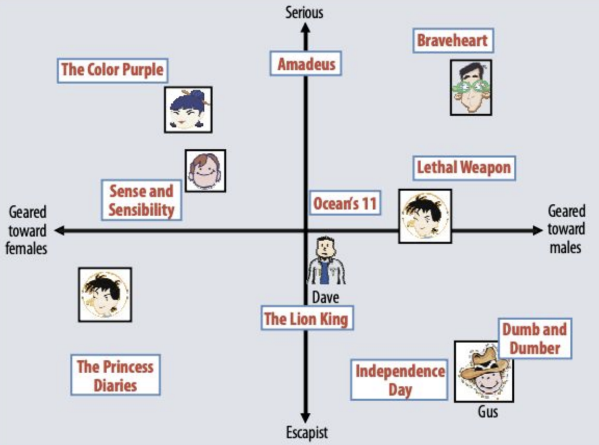

# 메모리 문제 : 
- free -m , config 설정 

# ALS 병렬처리
- X의 각 행 i는 Y와 A의 한 행의 함수로 독립적으로 계산 가능
- 독립적으로 수행할 수 있으니 병렬 처리가 가능
- 
- 

# split vs span 
- split은 string에서 쓸 수 있다. 인자 기준으로 자른다. python이랑 같음. 이상하게 " "도 괜찮고 ' '도 괜찮다. 
- span은 collection에서 쓸 수 있나? 인자로 predicator를 받는다. partition하는 것과 비슷 [링크](https://alvinalexander.com/scala/how-to-split-sequences-subsets-groupby-partition-scala-cookbook/)

# broadcast : **잘 이해 못함.** 82쪽 
- Driver 상의 로컬 Map인데도 모든 태스크에 자동으로 복사된다. 그래서 map함수에서 직접 참조할 수 있음.
- 이런 방식은 직렬화된 형태로 메모리를 점유한다.
- 이 데이터를 여러 번 복사하여 보내고 저장한다.
- broadcast 변수를 사용하면 딱 하나의 복사본만 보내고 메모리에 유지할 수 있다.
- 스파크가  어떤 스테이지를 실행하면 태스크를 실행하는데 필요한 모든 정보를 바이너리로 만든다.
    - 브로드캐스트를 쓰면 각 실행자에서 자바 객체 형태로 캐시한다. 역질렬화할 필요가 없다.
    - 여러 잡, 스테이지, 태스크에서 이용되는 데이터를 캐시한다.


# \_* 문법 
- python asterisk랑 비슷한듯. split, artistById.filter($"id" isin (recoArtistIDs:_*)).show() 
```Scala
def echo(args: String*) = 
    for (arg <- args) println(arg)

val arr = Array("What's", "up", "doc?")
echo(arr: _*)
```


# trainData 에서 cache 사용하는 이유? <br>
- 캐시 안 하면 buildCounts가 속해있는 task? 를 ALS에서 처리할 때 마다 다시한다. ALS까지 엮여 있는 task여서 그런것 같다.

# === vs == : 
- [링크](https://stackoverflow.com/questions/39490236/difference-between-and-in-scala-spark) <br>

# $"blah" 용법
- model.itemFactors.select($"id".as("artist")) : $는 왜 붙이는건지? <br>
- 54쪽,column 객체임을 나타내는 구문

# head, take, show, limit 차이
- head, take 은 같은 api인듯 -> Array를 return 
- show는 print하는 함수 -> unit return
- limit -> Dataset을 return
